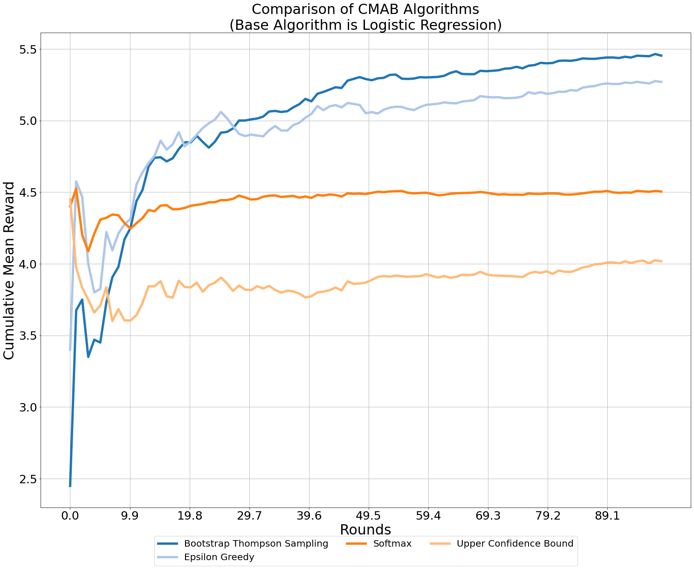

# Multi-Arm Contextual Bandits for Dynamic Pricing

*Alexander Mendelsohn*

Sales Data often lacks information about rejected deals, as it typically focuses only on successfully completed transactions. This introduces a bias known as survival bias, where the dataset excludes valuable insights from lost deals. To develop a more accurate model of price sensitivity, it is crucial to incorporate information about whether a specific offer was accepted or rejected by the client.

In this project, I aim to create a framework for dynamic individualized price optimization using multi-arm contextual bandits. These bandit algorithms enable the measurement of price sensitivity, but they are not readily available in standardized forms. While existing implementations often cater to use cases like recommender systems and click-through rates, the pricing use case differs in some fundamental ways.

Firstly, the action set (i.e., the prices) can be modeled as either continuous or discrete and possesses an order. For instance, a successful sale at price x implies successful sales at prices <= x. Secondly, the reward function is not binary. The customer's reaction to a given price simple yes/no response is binary. However, the optimization objective extends beyond maximizing the number of successful deals and includes maximizing the monetary rewards associated with these deals.

In this summary, I consolidate much of my research on this topic and propose adaptations to bandit algorithms that are better suited for the pricing use case. Additionally, I suggest approaches to address challenges related to low data throughput, such as the concept of cross-learning. These insights aim to enhance the effectiveness of dynamic price optimization and provide valuable strategies for dealing with limited data availability.

Algorithms are currently coded with numpy and Pandas. 
Next Step: impement algorithms with JAX library (https://github.com/google/jax).

## Contents:
* [Reinforcement Learning Intro](#Reinforcement-Learning)
* [Contextual Multi-Armed Bandits](#Contextual-Multi-Armed-Bandit)
    - [Exploitation vs. Exploration](#Exploitation-vs-Exploration)
    - [Bandits are a more effective A/B Test](#A-B-Test)
    - [Individual vs. Dynamic Pricing (Online Bandits)](#Dynamic-Pricing)
* [Posing Online Deposits as a Contextual Multi-Arm Bandit Problem](#Online-Deposits-CMAB)
    - [A Bayesian Framework](#Bayesian-Framework)
        - [Thompson Sampling](#Thompson-Sampling)
        - [Bootstrap Thompson Sampling with arbitrary base algorithm](#BTS)
            - [BTS Algorithm](#BTS_algo)
            - [BTS Online Algorithm](#BTS_online_algo)
    - [Other Baseline Algorithms](#baseline-algs)
        - [Epsilon-Greedy Algorithm](#Epsilon-Greedy)
        - [Softmax Algorithm](#Softmax-Algorithm)
        - [Bootstrap Upper Confidence Bound Algorithm](#BUCB)
    - [Bandit Python Class](#python-class)
    - [Simulations](#Simulations)   
    - [Further Ideas](#Further-Ideas)
        - [Leveraging on Historical Offline Data](#Historical-Offline-Data)
        - [New Client Definition](#NCD)
        - [Weighting Observations](#WO) 
        - [Cross-Lesarning between Clusters]

## Reinforcement Learning Intro <a class="anchor" id="Reinforcement-Learning"></a>

Reinforcement Learning (RL) is a type of machine learning technique that enables an agent to learn in an interactive environment by trial and error using feedback from its own actions and experiences.

<center></center>

Both supervised and reinforcement learning use mapping between input and output. Unlike supervised learning where the feedback provided to the agent is the correct set of actions for performing a task, reinforcement learning uses rewards and punishments as signals for positive and negative behavior.

<center></center>

Reinforcement learning is differs from unsupervised learning in terms of the final objective. While the goal in unsupervised learning is to find similarities and differences between data points; reinforcement learning aims to find a suitable action model that would maximize the total cumulative reward of the agent. The figure above illustrates the action-reward feedback loop of a generic RL model. An introductory book from Richard S. Sutton and Andrew G. Barto: [Reinforcement Learning:
An Introduction](https://yulizi123.github.io/static/files/Reinforcement_learning_An_introduction.pdf).

We will be using the following notations:
* **X**: context or state (features, e.g. client and product attributes, macroeconomic variables); 
* **a**: action (agent output, i.e. price offered to the client)
* **r**: reward/reaction (i.e, deal or no deal)

For our use case, we will be considering a discrete (ordinal) set of actions. The range of feasible prices is split by basis points or half basis points into a set of possible actions. The number of possible actions can range from 2 to a 1000 or more. The more actions the more data will be needed for the algorithm to converge to an optimal price. The rather simple simulation illustrated below will consider a set of possible 20 actions.

**It is possible and important for our use case to modify the reward structure such that the reward reflects the true profit and not only the win/loss status.**

## Contextual Multi-Armed Bandits <a class="anchor" id="Contextual-Multi-Armed-Bandit"></a>

The multi-armed Bandit problem is a classic reinforcement learning problem that exemplifies the **exploration–exploitation tradeoff dilemma**. The name comes from imagining a gambler at a row of slot machines (sometimes known as "one-armed bandits") with different payout distributions, who has to decide which machines to play, how many times to play each machine and in which order to play them, and whether to continue with the current machine or try a different machine.

<center></center>

The multi-armed Bandit problem becomes "contextual" when the choice of action further depends on available information. With the help of a relevant user data, multi-armed bandits can become context-based. Contextual bandit algorithms rely on an incoming stream of user context data, either historical or fresh, which can be used to make better algorithmic decisions in real-time.

### Exploitation vs. Exploration <a class="anchor" id="Exploitation-vs-Exploration"></a>

In our context, a descrete set of prices, can be offered to the client (referred to as *arms*). Some degree of **exploration** - trying different prices - is necessary to measure or learn about the price sensitivity of client groups. Price exploration is a sensible/necessary investment. At some point, knowledge about price sensitivity can be **exploited** and profits can be maximised. 

The trade-off between exploration and exploitation is non-trivial. There are some effective heuristic methods to solving this dilemma (e.g., epsilon-greedy policy) and the more scientific approach is typically a Bayesian approach (e.g., Thompson Sampling).

### Bandits are a more effective A/B Test <a class="anchor" id="A-B-Test"></a>

In traditional A/B testing methodologies, traffic is evenly split between two variations (each gets 50%). Multi-armed bandits allow you to dynamically allocate traffic to variations that are performing well while allocating less and less traffic to underperforming variations. Multi-armed bandits are known to produce faster results since there’s no need to wait for a single winning variation.

Bandit algorithms go beyond classic A/B testing, conveying a large number of algorithms to tackle different problems, all for the sake of achieving the best results possible. 

### Individual vs. Dynamic Pricing (Online Bandits) <a class="anchor" id="Dynamic-Pricing"></a>

The supervised learning approach previously applied in Smart Pricing models is ideal for individualised price offers. This approach assumes a stable representativity of historical data, i.e. that even patterns observed from older deals can be extrapolated to newer deals.

Bandit algorithms are designed to be very agile and continuously adjusted. *Online* Bandit algorithms by design also allow more weight to be placed on recent observations.

## Posing Online Deposits as a Contextual Multi-Arm Bandit Problem <a class="anchor" id="Online-Deposits-CMAB"></a>

Clients can request a deposit account online. Depending on the *context* - attributes of the company (e.g. size and sector) and the size and duration of the deposit - there may be, say, 20 relevant *arms* for a bank to play - $0, \frac{1}{2}, 1, 1\frac{1}{2}, ..., 10$ basis points interest rate on their deposit. *In practice it will make more sense considering the absolute or relative difference to the reference rate instead of the interest rate itself*.

For each offer, we receive a binary reward (accept or decline), taken from an Bernoulli experiment with parameter $θ_k$. Thus, at each round, each bandit behaves like a random variable $Y_k∼Bernoulli(θ_k)$. This version of the Multi-Armed Bandit is also called the Binomial bandit.

Which arm is optimal to play depends on the context.

What is unique about this particular problem is:
* **Arms are ordered and correlated**: if client A accepted (declined) 2pb she would clearly also accept 3 or 4 bp (decline 1 or 2 bp)
* **We ultimately have to maximize the expected profit and not the binary reward**. I.e., always offering 20 bp is an optimal solution to the Bernoulli Bandit but not optimal for profits.

The property of **ordered arms** could be used to our benefit by **inferring observations**. If a deposit was made at interest rate $x_k$, "win" observations can be inferrred for all actions $\{x_i : x_i \geq x_k \}$. Likewise if a deposit was declinded at interest rate $x_k$, "loss" observations can be inferred for actions $\{x_i : x_i \leq x_k \}$. 

### A Bayesian Framework <a class="anchor" id="Bayesian-Framework"></a>

Epistemic uncertainty (model uncertainty due to little data and/or changing historical observations) as well as a high degree of randomness in the structure of the context can be dealt with efficiently using a Bayesian framework.

We assume that each action $a$ has a set of unknown parameters $\theta_a$ governing its reward distribution, $\mathbb{P}(r_a \vert x_t, \theta_a)$, where $x_t$ denotes the context at time $t$.

We initially model our uncertainty about $\theta_a$ using a pre-specified prior distribution, $\mathbb{P}(\theta_a)$. In practice this corresponds to a first fit on historical data or the rewards observed on "uninformed" actions.

As new rewards are observed for action $a$, we update our model according to its so-called posterior distribution, $\mathbb{P}(\theta_a \vert D_{t,a})$. $D_{t,a}$ represents the set of context/reward pairs for the to times before time $t$ where action $a$ was offered, i.e., $D_{t,a} = \{ (x_s, r_{s,a_s}) : s \leq t, a_s = a \}$. 

$$\mathbb{P}(\theta_a \vert D_{t,a}) = \frac{\mathbb{P}(D_{t,a} \vert \theta_a)\mathbb{P}(\theta_a)}{\mathbb{P}(D_{t,a})}$$

Posterior distributions cannot be determined analytically for all distributions. They can be determined analytically for normal distributions but not for logit distributions which are more relevant for our use case. There are a number of parametric approximation methods. These parametric approaches would however constrain us to use a logistic regression as the base algorithm. 

The exploration-exploitation trade-off can be dealt with efficiently by choosing upcoming actions based on posterior probabilities of their success. The algorithm which does this is called "Thompson Sampling".

#### Thompson Sampling <a class="anchor" id="Thompson-Sampling"></a>

Thompson Sampling is a general algorithm for handling the exploration-exploitation trade-off in bandit problems. It has strong performance guarantees and has been proven to be efficient. (Interest in Thompson Sampling started when researchers Chapelle and Li at Yahoo demonstrated its strength in comparison to other popular algorithms, namely the Upper Confidence Bound algorithm, empirically. See ["An Empirical Evaluation of Thompson Sampling"
](https://proceedings.neurips.cc/paper/2011/file/e53a0a2978c28872a4505bdb51db06dc-Paper.pdf))

Thompson sampling also does not contain unspecified parameters which need to be tuned for proper exploration. 

Thompson sampling is essentially a probability matching heuristic. During each time step, every action's parameters $\theta_a$ are
first randomly sampled according to posterior distribution $\mathbb{P}(\theta_a \vert D_{t,a})$. Then, Thompson sampling chooses the action which maximizes expected reward with respect to the sampled parameters.

**for** $t = 1, ..., T$ **do** 

> observe context $x_t$

> **for** $a = 1, ..., K$ **do** 

>> sample $\tilde{\theta_{t,a}}$ according to $\mathbb{P}(\theta_a \vert D_{t,a})$

> **end**

> Choose action $a_t = argmax_a \mathbb{E}[r_a \vert x_t, \tilde{\theta_{t,a}}]$

> Update $D_{t,a_t}$ and $\mathbb{P}(\theta_a \vert D_{t,a_t})$ with $(x_t, r_{t, a_t})$

**end**

["A Tutorial on Thompson Sampling"](https://arxiv.org/pdf/1707.02038.pdf) gives a thorough introduction to Thompson Smapling and approximation methods for the posterior distribution in Bernoulli bandit setting (binary rewards). These approximations include:
* Laplace Approximation: fully parametric, assumes posterior distribution is Gaussian
* Langevin Monte Carlo: an Markov chain Monte Carlo method that uses gradient information about the target distribution
* Bootstrap: an approach based on the statistical bootstrap, which accommodates even very complex densities. Developed by Eckles and Kaptein in cooperation with Facebook, see ["Thompson Sampling with the Online Bootstrap
"](https://arxiv.org/pdf/1410.4009.pdf).

A further approximation not discussed in "A Tutorial on Thompson Sampling" is variational inference. Variational Inference assumes the posterior to be multivariate Gaussian (approximated by a malutivariate Gaussian). The optimal parameters are determined by minimizing the Kullback-Leibler entropy or equivalently maximizing Evidence Lower Bound (ELBO). Variational Inference has become more practicable with packages such as Pytorch or Tensorflow Autograd.

Bootstrap Thompson Sampling (BTS) is a heuristic method for solving bandit problems which modifies Thompson Sampling by replacing the posterior distribution used in Thompson sampling by a bootstrap distribution. Bootstrap Thompson bootstrap is more scalable than regular Thompson sampling, and more robust to a misspecified error distribution.

#### Bootstrap Thompson Sampling with arbitrary base algorithm <a class="anchor" id="BTS"></a> 

In the following we will consider an arbitrary base classifier $f$ and its $predict \_ proba$ function $\mathbb{P}_{f,a}(x_t)$. This can be thought of as a logistic regression or a random forest - any classifier with a $partial \_ fit$ function, a $predict \_ proba$ function and the option to weight observations is feasible. The sample used to fit the base classifier can either grow cumulatively or the classifier is trained in batches with partial fits (this referred to as an *online* algorithm).

Let $\mathbb{E}[r_a \vert f, x_t]$ denote the expected reward of action $a$ given the probabilities estimated by the classifier. The expected reward in our use case is not constrained to $\{0,1\}$ but we can still implement a binary classifier.

BTS replaces the posterior $\mathbb{P}(\theta_a \vert D_{t,a})$ by a bootstrap distribution of the point
estimate $\theta_a$. BTS exploits a statistical relationships between bootstrap distributions and Bayesian posteriors. Some bootstrap methods are especially computationally appealing. In particular, bootstrap methods that involve randomly reweighting data, rather than resampling data, can be conducted online (row by row),  e.g.: for each bootstrap replicate $j \in \{1, ..., J\}$, each observation gets a weight $w_{tj}∼Gamma(1,1)$ [footnote1](#gamma_motive). (see ["Thompson Sampling with the Online Bootstrap"](https://arxiv.org/pdf/1410.4009.pdf), weighting is very practical because positive observations are rare.) BTS is also a model agnostic inference method.

David Cortes has published a large collection of algorithms for online contextual bandits, see [Adapting multi-armed bandits policies to contextual bandits scenarios](https://arxiv.org/pdf/1811.04383.pdf).

Note: most of the examples inspected in the literature have a binary reward (win or loss). As stated above, the intricacy of our problem arises from the reality that we want to maximize not only the win probability but do so at the lowest possible price. If the algorithm poorly incorporates the real monetary reward, the bandit will likely converge to "over-bidding".

##### BTS Algorithm: <a class="anchor" id="BTS_algo"></a>

###### **Inputs** number of resamples $J$ and classifiers $f_{j}$ for $j \in \{1, ..., J\}$

**for** $t = 1, ..., T$ **do** 

> observe context $x_t$

> **for** $a = 1, ..., K$ **do** 

>> select resample $j_{a,t}$ uniformly at random from $1$ to $J$

> **end**

> choose action $a_t = argmax_a \mathbb{E}[r_a \vert f_{j_{a,t}}, x_t]$

> update $D_{t,a_t}$ with $(x_t, r_{t, a_t})$

> **for** $j \in \{1, ..., J\}$

>> take resample and refit $f_{j}$

> **end**

**end**

##### BTS Online Algorithm: <a class="anchor" id="BTS_online_algo"></a>

###### **Inputs** number of resamples $J$ and classifiers $f_{j}$ for $j \in \{1, ..., J\}$

**for** $t = 1, ..., T$ **do** 

> observe context $x_t$

> **for** $a = 1, ..., K$ **do** 

>> select resample $j_{a,t}$ uniformly at random from $1$ to $J$

> **end**

> choose action $a_t = argmax_a \mathbb{E}[r_a \vert f_{j_{a,t}}, x_t]$

> update $D_{t,a_t}$ with $(x_t, r_{t, a_t})$

> **for** $j \in \{1, ..., J\}$

>> Sample observation weight $w∼Gamma(1; 1)$

>> Update $f_{a,j}$ with the new observation $(x_t, r_{t, a_t})$ with weight $w$

> **end**

**end**

*COMMENT: It is not necessary to produce $J$ bootstrap estimates per action and pick one randomly. It is equivalent to simply produce a single bootstrap estimate.*
*BTS algorithm prescribes a bootstrap for each action.*

### Other Baseline Algorithms <a class="anchor" id="baseline-algs"></a>

Some of the simplist algorithms are Epsilon-Greedy algorithms, which consist in playing the empirical best arm with some high probability or a random arm otherwise. This is a very intuitive way of dealing with the exploration-exploitation trade-off. $p\%$ of deal opportunities are sacrificed to gather new observations and are given a random action. The other $(1-p)\%$ deal opportunities are exploited for profit.  

##### Epsilon-Greedy Algorithm: <a class="anchor" id="Epsilon-Greedy"></a>

###### **Inputs** probability $p \in ( 0,1 ] $, decay rate $d \in ( 0,1 ] $ and classifier $f$

**for** $t = 1, ..., T$ **do** 

> observe context $x_t$

> with probability $1-p$:

>> choose action $a_t = argmax_a \mathbb{E}[r_a \vert f , x_t]$

> update $p := p \cdot d$

> obtain reward $r^{t,a}$

> update $D_{t,a_t}$ with $(x_t, r_{t, a_t})$

> update $f$ with its new history

**end**

This random form of exploration can easily be transformed to **more active or informed forms of exploration**. 

##### Softmax Algorithm: <a class="anchor" id="Softmax-Algorithm"></a>

Another logical idea is to choose the action not by a simple argmax, but with a probability proportional to the estimates, such as $a∼Mult(softmax(\mathbb{E}[r_1 \vert f, x_t], ..., \mathbb{E}[r_K \vert f, x_t]))$ where $softmax(x_1, ..., x_n) = exp(x_1, ..., x_n)/\sum_i exp(x_i)$. Since our rewards are small percentages bounded by zero and one, it may be sensible to apply an inverse sigmoid function $sigmoid^{-1}(x) = log(\frac{x}{1-x})$ on these values before applying the softmax function. In order to make such a policy deal with the old data losing representativity quickly, a typical trick is to inflate the estimates before applying the softmax function by a multiplier $m$ (later referred to as **recency weight**) that gets larger with the number of rounds, so that the policy would tend to argmax with later iterations ([Adapting multi-armed bandits policies to contextual bandits scenarios](https://arxiv.org/pdf/1811.04383.pdf), Section 6).

###### **Inputs** multiplier $m$, inflation rate $i$ and classifier $f$

**for** $t = 1, ..., T$ **do** 

> observe context $x_t$

> with probability $1-p$:

>> sample action $a_t∼Mult(softmax(m \cdot sigmoid^{-1}(\mathbb{E}[r_1 \vert f, x_t], ..., \mathbb{E}[r_K \vert f, x_t])))$

> update $p := p \cdot d$

> obtain reward $r^{t,a}$

> update $D_{t,a_t}$ with $(x_t, r_{t, a_t})$

> update $f$ with its new history

**end**

##### Bootstrap Upper Confidence Bound Algorithm: <a class="anchor" id="BUCB"></a>

Upper confidence bound algorithms, also known as "optimism in the face of uncertainty", try to establish an upper bound on the expected reward (such bound gets closer to the observed mean as more observations are accumulated, thereby balancing exploration and exploitation).

We again apply a bootstrap approach instead using analytic/parametric formulas for upper confidence bounds in order keep the bandit model agnostic. Bootstrapping is here also performed by reweighting the sample with $Gamma(1; 1)$ distributed weights. The algorithm can also be applied in an online fashion such as online Thompson Sampling.

###### **Inputs** quantile $Q \in (0,1)$, number of resamples $J$ and classifiers $f_{j}$ for $j \in \{1, ..., J\}$

**for** $t = 1, ..., T$ **do** 

> observe context $x_t$

> **for** arm $a = 1, ..., K$ **do** 

>> set $r_{q,a} = Quantile_q(\mathbb{E}[r_a \vert f_{1}, x_t], ..., \mathbb{E}[r_a \vert f_{J}, x_t])$

> **end**

> choose action $a_t = argmax_a r_{q,a}$

> update $D_{t,a_t}$ with $(x_t, r_{t, a_t})$

> **for** $j \in \{1, ..., J\}$

>> take resample and refit $f_{j}$

> **end**

**end**

*ToDo: maybe Uri Goren's idea about patching classifiers predict_proba function so that algorithm is forced to converge to 90% (e.g.)*

### Bandit Python Class: <a class="anchor" id="python-class"></a>

The following class is used to instantiate a contextual multi-armed bandit applying one of the above algorithms.


```python
import numpy as np
import pandas as pd
from copy import deepcopy

class Smart_Bandit:
    """
    Class for implementation online contextual multi-arm bandit algorithm,
    Implements Online BTS, Epsilon-Greedy with d=1 and Softmax algorithm

    """
    
    # initialization
    def __init__(self, algorithm, epsilon, n_boots, quantile, n_choices, base_model, feature_list, reward_fct):
    
        #algorithm: "epsilon_greedy", "softmax", "thompson", "ucb" 
        self.algorithm = algorithm
        #epsilon for epsilon greedy algorithm
        self.epsilon = epsilon
        #number of bootstrap models; should be greater than the batch size
        self.n_boots = n_boots
        #numeration of bootstrap models
        self.boot_num = np.arange(0,self.n_boots)
        #quantile used for ucb algorithm 
        self.quantile = quantile
        #base classifier 
        self.base_model = base_model
        #number of actions
        self.n_choices = n_choices
        #list of all actions 
        self.all_arms = np.arange(1,self.n_choices+1)
        #list of features/exogenous variables, i.e. the context
        self.feature_list = feature_list
        #function which converts ordinal action to monetary reward in basis points
        self.reward_fct = reward_fct
        
        self.bmodels = []
        for i in range(self.n_boots):
            self.bmodels.append(deepcopy(self.base_model)) 
    
    def fit(self, X, a, r):
        
        """
        Function to fit base classifier
        Can be changed to implement partial_fit for online algorithm
        
        Parameters:
        X: context (array)
        a: actions (array)
        r: reactions (array)
        """
        
        df_temp = pd.DataFrame(X, columns = self.feature_list)
        df_temp["action"] = a
        df_temp["reaction"] = r
        
        #weight observations depending on algorithm
        if self.algorithm in ["thompson" , "ucb"]:
            for j in range(self.n_boots):
                np.random.seed(j)
                w = np.random.gamma(shape = 1, scale = 1, size = df_temp.shape[0])
                self.bmodels[j].fit(df_temp.drop(["reaction"], axis = 1).values, df_temp["reaction"].values, sample_weight = w)
        else:
            w = np.ones_like(a, dtype=np.int8) 
            self.base_model.fit(df_temp.drop(["reaction"], axis = 1), df_temp["reaction"], sample_weight = w)
        
    def predict_proba_true(self, X):
        
        """
        Function to get win probability as float
        
        Parameters:
        X: context (array)
        """

        return self.base_model.predict_proba(X)[:, 1]
    
    def predict_proba_true_model(self, X, model):
        
        """
        Function to get win probability as float from list of bootstrap models 
        
        Parameters:
        X: context (array)
        model: specified model [0:n_boot -1] (int) 
        """
            
        return self.bmodels[model].predict_proba(X.values.reshape(1, -1))[:, 1]
    
    def infer_observations(self, X, a, r):
        
        """
        Function to infer observations, i.e.:
            if offer accepted with x rate update also >=x to 'accepted'
            if offer declined with x rate update also <=x to 'declined'
        
        Parameters:
        X: context (array)
        a: actions (array)
        r: reactions (array)
        """
        
        df_temp = pd.DataFrame(X, columns = self.feature_list) 
        df_temp["action_ind"] = a
        df_temp["reaction"] = r
        df_temp["action"]= df_temp.apply(lambda row: [a for a in self.all_arms if a >= row["action_ind"]] if row["reaction"] else
                                       [a for a in self.all_arms if a <= row["action_ind"]], axis=1)
        df_temp = df_temp.drop("action_ind", axis=1).explode("action")
        temp_X = (df_temp.drop(["reaction","action"], axis=1)).to_numpy()
        temp_r = df_temp["reaction"].to_numpy()
        temp_a = df_temp["action"].to_numpy()

        return temp_X, temp_a, temp_r
    
    def get_actions_epsilon(self, X):
                
        """
        Function to produce actions based on the Epsilon Greedy Algorithm
        
        Parameters:
        X: context (array)
        """
        
        #array to pandas
        df_temp = pd.DataFrame(X, columns = self.feature_list)
        #explode dataset with all possible actions 
        df_temp["action"]= df_temp.apply(lambda row: [a for a in self.all_arms], axis=1)
        df_temp["obs"] = np.arange(0, df_temp.count()[0])
        df_temp = df_temp.explode("action")
        #determine 'win' probability for each action
        df_temp["p"] = self.predict_proba_true(df_temp.drop("obs", axis=1))
        #determine reward for each action
        df_temp["reward"] = df_temp.apply(lambda row: self.reward_fct(row["action"]), axis=1)
        #determine expected reward for each action
        df_temp["exp_reward"] = df_temp["p"]*df_temp["reward"]
        #determine action with max expected reward
        df_temp['max'] = df_temp.groupby(self.feature_list+["obs"])['exp_reward'].transform('max')
        #get best arm
        best_arm = pd.DataFrame(df_temp[df_temp["exp_reward"] == df_temp["max"]]["action"], columns = ["action"])
        #choose action based on ranom number and epsilon
        best_arm["choice"] = best_arm["action"].apply(lambda row: row if np.random.random()>self.epsilon else np.random.choice(np.delete(self.all_arms, row)))
        
        return best_arm["choice"].to_numpy()
    
    def get_actions_thompson(self, X):
        
        """
        Function to produce actions based on the Thompson Sampling Bootstrap Algorithm
        
        Parameters:
        X: context (array)
        """
        #array to pandas
        df_temp = pd.DataFrame(X, columns = self.feature_list)
        #explode dataset with all possible actions
        df_temp["action"]= df_temp.apply(lambda row: [a for a in self.all_arms], axis=1)
        #select bootstrap model at random uniformly per observation
        df_temp["model"] = np.random.randint(self.n_boots, size= df_temp.count()[0])
        df_temp["obs"] = np.arange(0, df_temp.count()[0])
        df_temp = df_temp.explode("action")
        df_temp=df_temp.reset_index(drop=True)
        df_temp=df_temp[self.feature_list+["action","model","obs"]]
        #determine 'win' probability for each action
        df_temp["p"] = df_temp.apply(lambda row: self.predict_proba_true_model(row.drop(["model","obs"]), row["model"])[0], axis=1)
        #determine reward for each action
        df_temp["reward"] = df_temp.apply(lambda row: self.reward_fct(row["action"]), axis=1)
        #determine expected reward for each action
        df_temp["exp_reward"] = df_temp["p"]*df_temp["reward"]
        #determine action with max expected reward
        df_temp['max'] = df_temp.groupby(self.feature_list+["obs"])['exp_reward'].transform('max')
        #get best action
        best_arm = pd.DataFrame(df_temp[df_temp["exp_reward"] == df_temp["max"]]["action"], columns = ["action"])

        return best_arm["action"].to_numpy()
    
    def get_actions_ucb(self, X):
        
        """
        Function to produce actions based on the Bootstrap Upper Confidence Bound Algorithm
        
        Parameters:
        X: context (array)
        """
        #array to pandas
        df_temp = pd.DataFrame(X, columns = self.feature_list)
        #explode dataset with all possible actions
        df_temp["action"]= df_temp.apply(lambda row: [a for a in self.all_arms], axis=1)
        #select bootstrap model at random uniformly per observation
        df_temp["model"] = df_temp.apply(lambda row: [b for b in self.boot_num], axis=1)
        df_temp["obs"] = np.arange(0, df_temp.count()[0])
        df_temp = df_temp.explode("action")
        df_temp = df_temp.explode("model")
        df_temp=df_temp.reset_index(drop=True)
        df_temp=df_temp[self.feature_list+["action","model","obs"]]
        #determine 'win' probability for each action
        df_temp["p"] = df_temp.apply(lambda row: self.predict_proba_true_model(row.drop(["model","obs"]), row["model"])[0], axis=1)
        #determine reward for each action
        df_temp["reward"] = df_temp.apply(lambda row: self.reward_fct(row["action"]), axis=1)
        #determine expected reward for each action
        df_temp["exp_reward"] = df_temp["p"]*df_temp["reward"]
        #determine upper confidence bound of expected reward for each action
        df_temp = df_temp.groupby(self.feature_list+["action","obs"])['exp_reward'].quantile(self.quantile).reset_index(name = 'ucb_exp_reward')
        #determine action with max expected reward
        df_temp['max'] = df_temp.groupby(self.feature_list+["obs"])['ucb_exp_reward'].transform('max')
        #get best action
        best_arm = pd.DataFrame(df_temp[df_temp["ucb_exp_reward"] == df_temp["max"]]["action"], columns = ["action"])

        return best_arm["action"].to_numpy()
    
    def get_actions_softmax(self, X, recency_weight):
        
        """
        Function to produce actions based on the Softmax Algorithm
        
        Parameters:
        X: context (array)
        recency_weight: (array) weight 'm' applied to observations
        """
        
        #array to pandas
        df_temp = pd.DataFrame(X, columns = self.feature_list)
        #recency weight
        df_temp["w"] = recency_weight
        #number the observations
        df_temp["obs"] = np.arange(0, df_temp.count()[0])
        #explode dataset with all possible actions 
        df_temp["action"]= df_temp.apply(lambda row: [a for a in self.all_arms], axis=1)
        df_temp = df_temp.explode("action")
        #determine 'win' probability for each action
        df_temp["p"] = self.predict_proba_true(df_temp.drop(["w","obs"], axis = 1))
        #apply inverse sigmoid function
        df_temp["sigmoid"] = np.log(df_temp["p"]/(1-df_temp["p"]))
        #determine reward for each action
        df_temp["reward"] = df_temp.apply(lambda row: self.reward_fct(row["action"]), axis=1)
        #softmax summand
        df_temp["softmax_summand"] = np.exp((df_temp["w"]*df_temp["sigmoid"]*df_temp["reward"]).astype(float)) #/sum(np.exp((df_temp["sigmoid"]*df_temp["reward"]).astype(float)))
        #softmax denominator
        df_temp["softmax_denominator"] = df_temp.groupby(self.feature_list+["obs"])['softmax_summand'].transform('sum')
        #softmax value
        df_temp["softmax"] = df_temp["softmax_summand"]/df_temp["softmax_denominator"]
        
        #select action randomly according to softmax probability
        fn = lambda obj: np.random.choice(obj["action"].to_numpy(), p=obj["softmax"].to_numpy())
        
        choice_map = (df_temp.groupby(self.feature_list+["obs"], as_index=False).apply(fn)).rename(columns = {None:"choice"})
        df_temp = df_temp.merge(choice_map, on=self.feature_list+["obs"], how="left")
        
        return df_temp[df_temp["action"] == df_temp["choice"]]["action"].to_numpy()
    

    def get_actions(self, X, recency_weight):
        
        """
        Wrapper function of the other get_action functions
        
        Parameters:
        X: context (array)
        recency_weight: (array) weight 'm' applied to observations
        """
        if self.algorithm == "thompson":
            x = self.get_actions_thompson(X)
        elif self.algorithm == "ucb":
            x = self.get_actions_ucb(X)
        elif self.algorithm == "softmax":
            x = self.get_actions_softmax(X, recency_weight)
        else:
            x = self.get_actions_epsilon(X)
            
        return x 
```

### Simulations <a class="anchor" id="Simulations"></a>

We simulate data based on the following distribtuion. Observations are simulated such that, for example, a client with attributes 'Branche (*Sector*) 3' & 'Groesse (*Size*) 1' will accept an offer above 3 basis points and decline an offer below 3 basis points (with noise). A sample of a 1000 observations was created. 


```python
rates_dict = {
    ('Branche 1','Groesse 1'): [1,1],
    ('Branche 2','Groesse 1'): [2,1],
    ('Branche 3','Groesse 1'): [3,1],
    ('Branche 1','Groesse 2'): [4,1],
    ('Branche 2','Groesse 2'): [5,1],
    ('Branche 3','Groesse 2'): [6,1]
}
```

The simulation is run in **batches** with a **cold start**:

* **Cold Start**: the model is not pretrained before it goes *live*. 
* **Batches**: in each iteration a batch of 10 observations are assigned actions according to the respective algorithm and reactions are simulated. Batches could be thought of as the data gathered within a day/week.  The observations are appended to the data history and the model is refit. *- Note: using the partial_fit function, the fit can also be updated iteratively on each batch*.
* **Actions**: we have 20 possible actions, i.e. 0.5, 1, 1.5, 2, 2.5, ..., 10 basis points are the rates explored by the algorithm. *- Note: in practice actions will represent basis points below external rate.*
* **Reward**: the reward is the difference between the interest given to the client and the interest we can generate the liquidity. For the simulation the reward is set to **$abs(10-action)$** basis points for won deals, 0 otherwise.
* **Base Model:** logistic regression *- Note: historical data can be used to analyze which base model (e.g. GBM, forest, NN) is best suited to the case taking into consideration any interpretability constraints.*

All algorithms above are run in parrallel and compared in the plot below. We compare cumulative mean reward:
* **Reward per Batch $b_i$:** $r_{b_i} =\sum_{action} \mathbb{1}_{win}(action) \cdot (10-a)$
* **Cumulative Mean Reward for $k$ batches**: $\frac{\sum r_{b_i}}{kx10}$



**Results:** all algorithms seem to learn very fast and converge after about 90 batches with 10 observations each \-- granted, they are learning a very simple distribution here. Thompson Sampling, which is proven to be an efficient algorithm, does outperform the Epsilon Greedy algorithm a little and seems to converge towards more rewarding actions. The Softmax algorithms performance is quite poor. When the binary rewards and the regrets (the reward difference between the most rewarding action and the action chosen by the algorithm) one sees that the Softmax algorithm does win a comparable number of deals but does so expensively. The Upper Confidence Bound algorithm (here applying the 60% quantile) does learn but consistently chooses margins which are too low and looses many deals. This indicates that the bootstrapped quanitle does not converge towards the true mean very quickly. Perhaps a larger number of bootstrap samples could improve theses results.

### Further Ideas <a class="anchor" id="Further-Ideas"></a>

#### Leveraging on Historical Offline Data <a class="anchor" id="Historical-Offline-Data"></a>

The data collected from customer consultants closed deals only includes data from won deals and no lost deals. It cannot be used to train bandits directly. Nevertheless, there some options to leverage on these historical observations. All of these options' viability depend on the historical data's representiveness of current market prices.

* Historical data should be analysed to determine a feasible set of actions. If dominant or obvious clusters are visible multiple bandits may have to be defined.
* A simple regression model based on offline data can be used to choose actions more efficiently at the beginning. This is a strong alternative to the cold start scenario where actions are chosen randomly at the beginning of the process. 
* Lost deals information could be simulated from historically observed prices much as data was simulated in the simulation above. In the data simulation clients accept offers below their historical obtained prices (or the prices allocated to them by a regression model) and decline offers above. Simulated data is then used to pretrain bandits.
* Several quantile regressions are performed on historical offline data (e.g. 40%, 42%, ...., 60% quantile regressions). The set of actions defined for the bandit are then always the set of prices prescribed by these quantile regression models.

#### New Client Definition <a class="anchor" id="NCD"></a>

The same client should not be offered different conditions within a small time period. A 'new' client deserving a new offer could be defined (suggestion) as a client who has not visited the portal within the current work week (e.g.).

#### Weighting Observations <a class="anchor" id="WO"></a>

Since the market is fast changing, putting more emphasis on recent deal reactions can be beneficial. This can easily be incorporated once appropriate weights are determined.

#### Footnotes:

<a id='gamma_motive'></a> **$Gamma(1, 1)$ Weights**: In theory, as the sample size grows to infinity, the number of times that an observation appears in a resample should be a random number distributed $∼ Poisson(1)$, and one possibility is to take each observation as it arrives a random number of times $n ∼ Poisson(1)$.
The $Gamma(1, 1)$ weights provide almost the same results on average as the real bootstrap and the $Poisson(1)$ number of samples, and is perhaps a better alternative for classification as it avoids bad resamples resulting in only observations
of one class. For a more intuitive explanation of the choice, recall that a $Gamma(1, 1)$ distribution would indicate, for example, expected time between events that happen at rate $∼ Poisson(1)$, thereby acting as a mostly equivalent but smoother weighting than full inclusion/exclusion. ([Adapting multi-armed bandits policies to contextual bandits scenarios](https://arxiv.org/pdf/1811.04383.pdf), Appendix)
